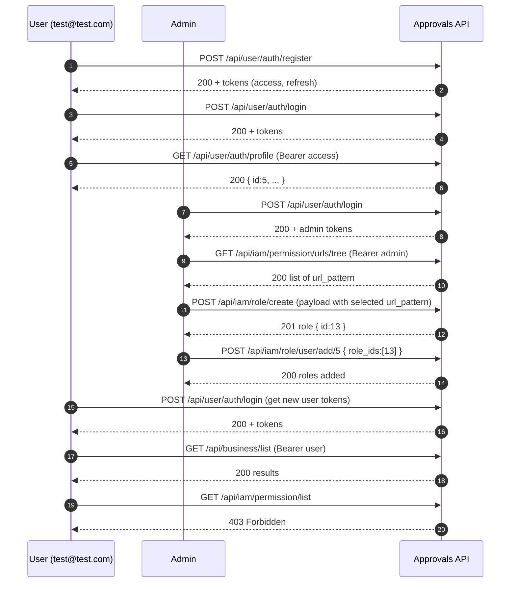

# Approvals IAM — End‑to‑End Roles & Permissions Walkthrough

**Base URL:** `https://approvals.isanapps.com`

This guide documents a full happy‑path flow:
1) Register a new end user → 
2) Log in and fetch profile → 
3) Admin logs in → 
4) Discover available permissions → 
5) Create a role with selected permissions → 
6) Assign role to the user → 
7) Verify allowed and forbidden access for the user.

> **Auth model**: Endpoints expect **JWT access tokens** in the `Authorization: Bearer <ACCESS_TOKEN>` header. The API also returns a `refresh` token, but this guide uses the **access** token for requests.

---

## Quick variables (recommended)

For cURL ergonomics, you can export environment vars in your terminal:

```bash
export BASE_URL="https://approvals.isanapps.com"
# After each login, set:
export ACCESS_TOKEN="<PASTE_ACCESS_TOKEN_HERE>"
```

Then use them like:

```bash
curl --location "$BASE_URL/api/anything" \
  --header "Authorization: Bearer $ACCESS_TOKEN"
```

---

## 1) Register a new user
**Endpoint:** `POST /api/user/auth/register/`

**Request**
```bash
curl --location "$BASE_URL/api/user/auth/register/" \
  --header 'Accept: application/json' \
  --header 'Content-Type: application/json' \
  --data '
{
  "email": "test@test.com",
  "firstName": "John",
  "lastName": "Doe",
  "title": "Mr.",
  "address": "123 Main St",
  "telephone1": "555-123-4567",
  "changePassNxtLog": null,
  "lastLoginDate": "2024-12-28T12:00:00Z",
  "firstLoginDate": "2024-11-28T12:00:00Z",
  "is_active": true,
  "is_admin": false,
  "password":"123123",
  "password2":"123123"
}'
```

**Response (example)**
```json
{
  "token": {
    "refresh": "<REFRESH_TOKEN>",
    "access": "<ACCESS_TOKEN>"
  },
  "msg": "Registration Success"
}
```

> **Note:** Copy the `access` token to `$ACCESS_TOKEN` if you want to immediately call authenticated endpoints.

---

## 2) Log in with the new user
**Endpoint:** `POST /api/user/auth/login/`

**Request**
```bash
curl --location "$BASE_URL/api/user/auth/login/" \
  --header 'Accept: application/json' \
  --header 'Content-Type: application/json' \
  --data-raw '{
    "email":"test@test.com",
    "password":"123123"
}'
```

**Response (example)**
```json
{
  "token": {
    "refresh": "<REFRESH_TOKEN>",
    "access": "<ACCESS_TOKEN>"
  },
  "msg": "Login Success"
}
```

Set the access token for subsequent calls:
```bash
export ACCESS_TOKEN="<ACCESS_TOKEN_FROM_RESPONSE>"
```

---

## 3) Get the user profile
**Endpoint:** `GET /api/user/auth/profile`

**Request**
```bash
curl --location "$BASE_URL/api/user/auth/profile" \
  --header "Authorization: Bearer $ACCESS_TOKEN"
```

**Response (example)**
```json
{
  "id": 5,
  "email": "test@test.com",
  "firstName": "John",
  "lastName": "Doe",
  "title": "Mr.",
  "address": "123 Main St",
  "is_admin": false,
  "telephone1": "555-123-4567"
}
```

> We will use `id = 5` later when assigning roles.

---

## 4) Admin logs in
**Endpoint:** `POST /api/user/auth/login/`

**Request**
```bash
curl --location "$BASE_URL/api/user/auth/login/" \
  --header 'Accept: application/json' \
  --header 'Content-Type: application/json' \
  --data-raw '{
    "email":"a.mahmoud@transtecbds.com",
    "password":"Trans@321"
}'
```

**Response (example)**
```json
{
  "token": {
    "refresh": "<REFRESH_TOKEN>",
    "access": "<ADMIN_ACCESS_TOKEN>"
  },
  "msg": "Login Success"
}
```

Set admin token:
```bash
export ACCESS_TOKEN="<ADMIN_ACCESS_TOKEN>"
```

---

## 5) Discover permission URL patterns (admin)
**Endpoint:** `GET /api/iam/permission/urls/tree`

**Request**
```bash
curl --location "$BASE_URL/api/iam/permission/urls/tree?page_size=2&page=1&ordering=-id" \
  --header "Authorization: Bearer $ACCESS_TOKEN"
```

**Response (excerpt)**
```json
{
  "data": [
    {"url_pattern": "/api/user/auth/register/", "name": "register"},
    {"url_pattern": "/api/user/auth/login/", "name": "login"},
    {"url_pattern": "/api/user/auth/profile/", "name": "profile"},
    {"url_pattern": "/api/user/users/list", "name": "list-users"},
    {"url_pattern": "/api/business/list", "name": "list-business-partner"},
    {"url_pattern": "/api/iam/role/list", "name": "role.list"},
    ...
  ]
}
```

> Choose the `url_pattern` values you want to include in a role.

---

## 6) Create a role with selected permissions (admin)
**Endpoint:** `POST /api/iam/role/create`

**Request**
```bash
curl --location "$BASE_URL/api/iam/role/create" \
  --header 'Accept: application/json' \
  --header 'Content-Type: application/json' \
  --header "Authorization: Bearer $ACCESS_TOKEN" \
  --data '
{
  "name":"role for test user ",
  "permissions": [
    {
      "name":"list all the business",
      "url_pattern":"/api/business/list"
    },
    {
      "name":"list all the roles",
      "url_pattern":"/api/iam/role/list"
    }
  ]
}'
```

**Response**: `201 Created` with role payload (implementation‑dependent).

---

## 7) List roles to find the created role id (admin)
**Endpoint:** `GET /api/iam/role/list`

**Request**
```bash
curl --location "$BASE_URL/api/iam/role/list?select=name%2Cid&filter=&page_size=2&page=1&ordering=-id" \
  --header "Authorization: Bearer $ACCESS_TOKEN"
```

**Response (example)**
```json
{
  "count": 8,
  "next": "http://localhost:8000/api/iam/role/list?filter=&ordering=-id&page=2&page_size=2&select=name%2Cid",
  "previous": null,
  "results": [
    { "id": 13, "name": "role for test user "},
    { "id": 12, "name": "BP102"}
  ],
  "total_pages": 4
}
```

> In this example, the new role id is **13**.

---

## 8) Assign the role to the user (admin)
**Endpoint:** `POST /api/iam/role/user/add/<user-id>`

**Path params:** `user-id = 5` (from profile)

**Request**
```bash
curl --location "$BASE_URL/api/iam/role/user/add/5" \
  --header 'Accept: application/json' \
  --header 'Content-Type: application/json' \
  --header "Authorization: Bearer $ACCESS_TOKEN" \
  --data '{
    "role_ids":[13]
}'
```

**Response (example)**
```json
{
  "message": "Roles added to user 'John'.",
  "added_roles": [
    "role for test user "
  ]
}
```

---

## 9) Verify access with the test user

### 9.1) Log in again as the test user
**Endpoint:** `POST /api/user/auth/login/`

**Request**
```bash
curl --location "$BASE_URL/api/user/auth/login/" \
  --header 'Accept: application/json' \
  --header 'Content-Type: application/json' \
  --data-raw '{
    "email":"test@test.com",
    "password":"123123"
}'
```

**Response (example)**
```json
{
  "token": {
    "refresh": "<REFRESH_TOKEN>",
    "access": "<ACCESS_TOKEN>"
  },
  "msg": "Login Success"
}
```

Set the user token:
```bash
export ACCESS_TOKEN="<ACCESS_TOKEN_FROM_RESPONSE>"
```

### 9.2) Call an **allowed** endpoint (`/api/business/list`)
**Endpoint:** `GET /api/business/list`

**Request**
```bash
curl --location "$BASE_URL/api/business/list" \
  --header "Authorization: Bearer $ACCESS_TOKEN"
```

**Response (example)**
```json
{
  "count": 1,
  "next": null,
  "previous": null,
  "results": [
    {
      "id": 1,
      "name": "Acme Corporation",
      "Email": "contact@acme.com",
      "WebSite": "https://www.acme.com",
      "MobilePhone": "+1234567890",
      "VatLiable": true,
      "VatRegNo": "VAT123456789",
      "RegCommNo": "REG123456789",
      "Address": "123 Main St, Anytown, USA",
      "Country": "USA",
      "State": "California",
      "ZipCode": "12345",
      "City": "Anytown",
      "ERPCode": "ACME-ERP-001",
      "Status": "Active",
      "Attachment": 1
    }
  ],
  "total_pages": 1
}
```

### 9.3) Call a **forbidden** endpoint (not in role)
**Endpoint:** `GET /api/iam/permission/list`

**Request**
```bash
curl --location "$BASE_URL/api/iam/permission/list?page_size=2&page=1&ordering=-id" \
  --header "Authorization: Bearer $ACCESS_TOKEN"
```

**Response (example)**
```
status: 403 Forbidden

You do not have permission to access this URL.
```

> ✅ At this point, role‑based authorization is functioning as expected.

---

## Mermaid — End‑to‑End Flow (Happy Path)



---

## Troubleshooting & Notes

- **401 Unauthorized**: Ensure `Authorization: Bearer <ACCESS_TOKEN>` is present and not expired. Always use the **access** token, not the refresh token, in headers.
- **403 Forbidden**: The token is valid, but the role assigned to the user does not include the endpoint’s `url_pattern` permission.
- **URL patterns with parameters**: The permission tree may contain parameterized patterns (e.g., `/api/user/admin/update/<int:pk>` and wildcard forms like `/api/user/admin/update/*`). Confirm which pattern your role should include.
- **Pagination & filters**: Many list endpoints support `page`, `page_size`, `ordering`, and `filter`. Adjust as needed.
- **Token rotation**: If access tokens are short‑lived, re‑login to obtain a fresh one or use your refresh flow if supported by your deployment.

---

## Appendix — Minimal Postman Collection (optional)

> Import this JSON into Postman and set a collection variable `base_url` to `https://approvals.isanapps.com`. Use the login responses to paste `access` tokens in the **Authorization** header (Bearer).

```json
{
  "info": {"name": "Approvals IAM Walkthrough", "schema": "https://schema.getpostman.com/json/collection/v2.1.0/collection.json"},
  "item": [
    {"name": "Register", "request": {"method": "POST", "header": [{"key":"Content-Type","value":"application/json"}], "url": "{{base_url}}/api/user/auth/register/", "body": {"mode":"raw","raw": "{\n  \"email\": \"test@test.com\",\n  \"firstName\": \"John\",\n  \"lastName\": \"Doe\",\n  \"title\": \"Mr.\",\n  \"address\": \"123 Main St\",\n  \"telephone1\": \"555-123-4567\",\n  \"changePassNxtLog\": null,\n  \"lastLoginDate\": \"2024-12-28T12:00:00Z\",\n  \"firstLoginDate\": \"2024-11-28T12:00:00Z\",\n  \"is_active\": true,\n  \"is_admin\": false,\n  \"password\":\"123123\",\n  \"password2\":\"123123\"\n}"}}},
    {"name": "User Login", "request": {"method": "POST", "header": [{"key":"Content-Type","value":"application/json"}], "url": "{{base_url}}/api/user/auth/login/", "body": {"mode":"raw","raw": "{\n  \"email\":\"test@test.com\",\n  \"password\":\"123123\"\n}"}}},
    {"name": "Profile", "request": {"method": "GET", "header": [{"key":"Authorization","value":"Bearer {{access_token}}"}], "url": "{{base_url}}/api/user/auth/profile"}},
    {"name": "Admin Login", "request": {"method": "POST", "header": [{"key":"Content-Type","value":"application/json"}], "url": "{{base_url}}/api/user/auth/login/", "body": {"mode":"raw","raw": "{\n  \"email\":\"a.mahmoud@transtecbds.com\",\n  \"password\":\"Trans@321\"\n}"}}},
    {"name": "Permission URLs Tree", "request": {"method": "GET", "header": [{"key":"Authorization","value":"Bearer {{admin_access_token}}"}], "url": "{{base_url}}/api/iam/permission/urls/tree?page_size=2&page=1&ordering=-id"}},
    {"name": "Create Role", "request": {"method": "POST", "header": [{"key":"Content-Type","value":"application/json"},{"key":"Authorization","value":"Bearer {{admin_access_token}}"}], "url": "{{base_url}}/api/iam/role/create", "body": {"mode":"raw","raw": "{\n  \"name\":\"role for test user \",\n  \"permissions\": [\n    { \"name\":\"list all the business\",\n      \"url_pattern\":\"/api/business/list\"\n    },\n    { \"name\":\"list all the roles\",\n      \"url_pattern\":\"/api/iam/role/list\"\n    }\n  ]\n}"}}},
    {"name": "List Roles", "request": {"method": "GET", "header": [{"key":"Authorization","value":"Bearer {{admin_access_token}}"}], "url": "{{base_url}}/api/iam/role/list?select=name%2Cid&filter=&page_size=2&page=1&ordering=-id"}},
    {"name": "Assign Role to User (id=5)", "request": {"method": "POST", "header": [{"key":"Content-Type","value":"application/json"},{"key":"Authorization","value":"Bearer {{admin_access_token}}"}], "url": "{{base_url}}/api/iam/role/user/add/5", "body": {"mode":"raw","raw": "{\n  \"role_ids\":[13]\n}"}}},
    {"name": "User — List Business", "request": {"method": "GET", "header": [{"key":"Authorization","value":"Bearer {{access_token}}"}], "url": "{{base_url}}/api/business/list"}},
    {"name": "User — Forbidden Permission List", "request": {"method": "GET", "header": [{"key":"Authorization","value":"Bearer {{access_token}}"}], "url": "{{base_url}}/api/iam/permission/list?page_size=2&page=1&ordering=-id"}}
  ]
}
```

---

**Done.** This document is ready to copy into your repo or share with stakeholders. If you want this saved as a `.md` file attachment, say “export to md” and I’ll provide the downloadable file.
