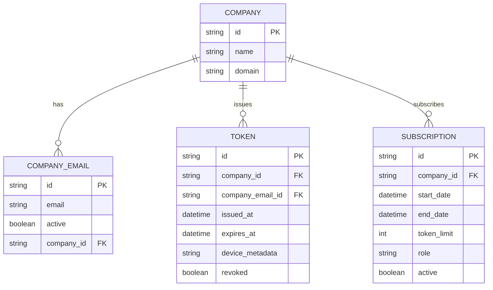
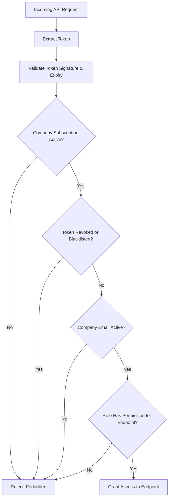
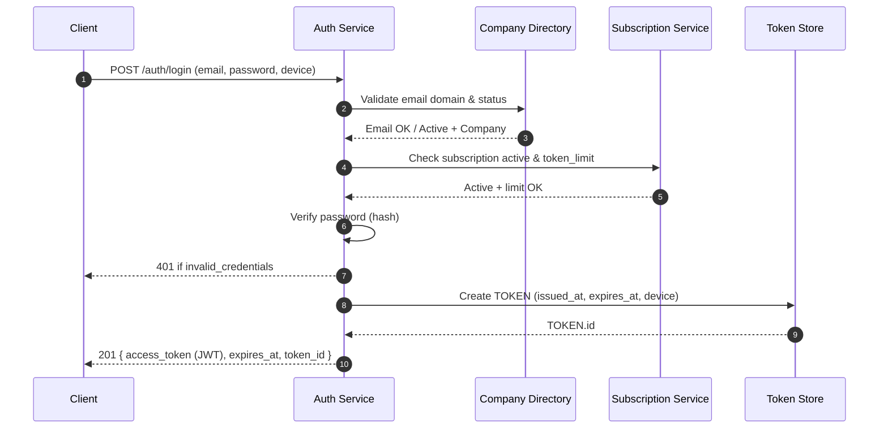
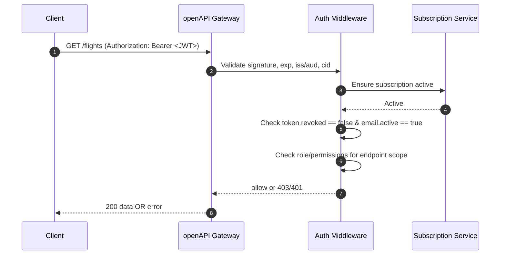
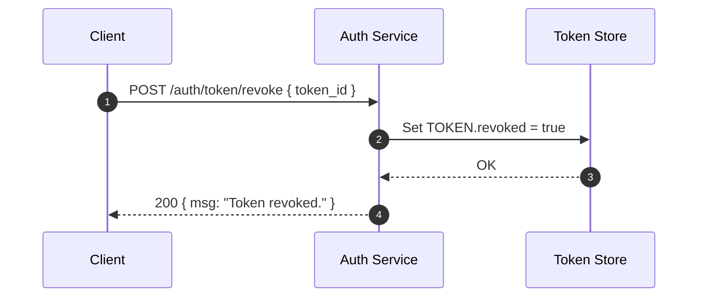
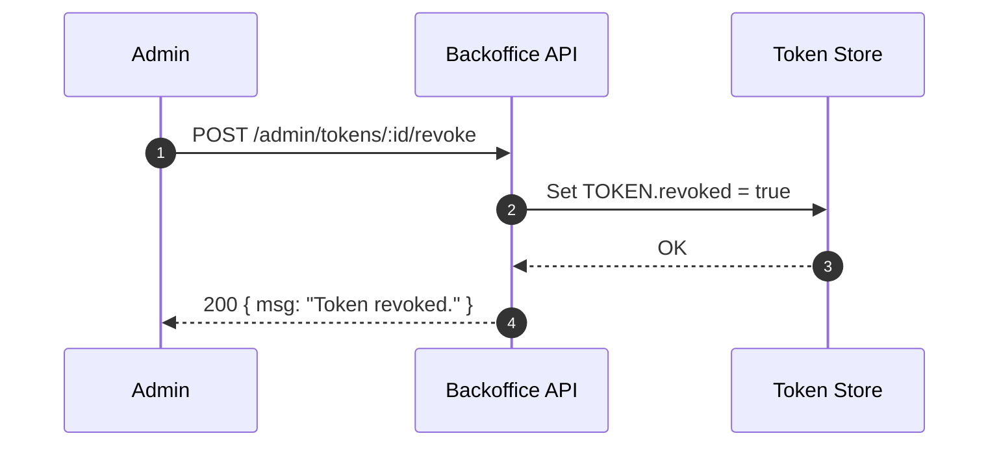
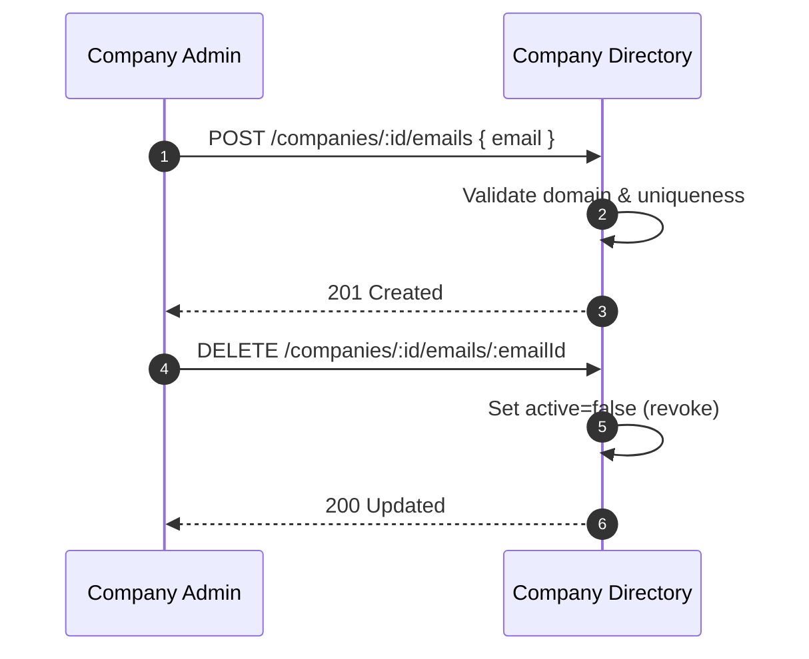

# Authentication Service — Technical Documentation (openAPI Bridge, Company‑Based Auth)

> **Context:** This Authentication Service secures the **openAPI Integration Bridge** for external companies integrating with FlyAkeedCorp systems. It implements **company‑based authentication** (no end‑users) and **server‑to‑server** token issuance with **no refresh tokens**, per business rules. Where a conventional refresh flow is mentioned, it is explicitly **disabled** for this openAPI context and documented for completeness.

---

## 1) Module Overview

**Purpose:** Provide secure, company‑scoped authentication and authorization for partner integrations via the openAPI Bridge.

**Core responsibilities:**
- Validate **company credentials** (company email + password with domain restriction).
- Issue short‑lived **access tokens (JWT)**; **no refresh tokens** for S2S.
- Enforce **subscription limits** (token count, expiry) and **role‑based endpoint permissions**.
- Support **token lifecycle** actions (issue, list, revoke/blacklist, delete) via company self‑service and back‑office.
- Provide **middleware** to gate every protected endpoint by token validity, subscription status, email status, and permissions.

**Design defaults:**
- **JWT algorithm:** RS256 (asymmetric). Private key server‑side; public key distributed to verifiers.
- **Access token TTL:** Configurable (e.g., 60 minutes). Effective validity = `min(token.expires_at, subscription.end_date)`.
- **Clock skew tolerance:** ±60s.
- **Token audience (aud):** `openapi.flyakeedcorp`.
- **Issuer (iss):** `auth.openapi.flyakeedcorp`.

---

## 2) Module Interactions

**Inbound callers**
- **External Partner Clients** (server‑to‑server) — use company credentials to obtain tokens; call protected business APIs via openAPI.
- **Backoffice UI / Admin API** — manage companies, subscriptions, emails, and tokens.

**Downstream dependencies**
- **User/Company Directory** — persistent store for `COMPANY` and `COMPANY_EMAIL`.
- **Subscription Service** — defines plan, token limits, and expiry.
- **Protected Business Modules** (Flights, Employees, Companies, Hotels, etc.) — validate access JWT on each request.

**Relationship / dependencies**
- All **protected endpoints** require a **valid access token** and **permission** for the specific route.
- Token acceptance requires: signature valid, not expired, not revoked, email active, company subscription active, and role‑permission allows the route.

---

## 3) Data Model

### Entities
- **COMPANY** — integration tenant; owns domain, subscription(s), and tokens.
- **COMPANY_EMAIL** — company account emails; must match company domain; may be individually activated/revoked.
- **SUBSCRIPTION** — plan, token limit, effective dates, role.
- **TOKEN** — issued JWT metadata (revocation state, expiry, device metadata, associated company + email).

### ERD (Mermaid)


### Token (JWT) claims (example)
```json
{
  "iss": "auth.openapi.flyakeedcorp",
  "aud": "openapi.flyakeedcorp",
  "sub": "token:1f7c2c...",             // TOKEN.id
  "cid": "comp_2a91...",                // COMPANY.id
  "email": "api1@companya.com",         // COMPANY_EMAIL.email
  "role": "partner_admin",              // from SUBSCRIPTION.role or explicit RBAC assignment
  "perms": ["flights.read", "employees.read"],
  "iat": 1737030000,
  "exp": 1737033600,                     // <= subscription.end_date
  "device": {
    "name": "build-server-01",
    "ip": "203.0.113.42",
    "agent": "curl/8.4"
  }
}
```

---

## 4) Authorization Model

**Roles & Permissions**
- Each subscription (or company assignment) provides a **role** with an associated **permission matrix**.
- Permissions map to **endpoint scopes**, e.g., `flights.read`, `employees.write`.
- Middleware enforces **endpoint → required permissions**.

**Isolation**
- Every token is **company‑scoped**. Cross‑company data access is forbidden by design.

---

## 5) Middleware Flow



---

## 6) API Endpoints

> **Base URL**: `/auth/*` (versioned under `/v1/auth/*` when applicable)

### Summary Table

| Method | Path                 | Auth            | Purpose |
|-------:|----------------------|-----------------|---------|
| POST   | `/auth/login`        | Basic (email+pw)| Issue new access token (no refresh token). |
| POST   | `/auth/token`        | Basic (email+pw)| Issue **additional** token (same as login; explicit action). |
| GET    | `/auth/tokens`       | Bearer (JWT)    | List active tokens for company/email. |
| POST   | `/auth/token/revoke` | Bearer (JWT)    | Revoke a token by ID (self‑service). |
| POST   | `/auth/refresh`      | **Disabled**    | Conventional refresh flow — **returns 405** in openAPI S2S mode. |

> Backoffice/Admin endpoints live under `/admin/*` (e.g., `/admin/tokens`, `/admin/tokens/:id/revoke`).

---

### 6.1 POST `/auth/login` — Issue Access Token (No Refresh)

**Purpose / Logic**
- Authenticate **company email + password**.
- Verify email belongs to company domain and is **active**.
- Verify **subscription active** and **token_limit** not exceeded.
- Issue JWT access token; persist `TOKEN` row with device metadata and `expires_at` = `min(now + token_ttl, subscription.end_date)`.

**Input**
```json
{
  "email": "api1@companya.com",
  "password": "string",
  "device": {
    "name": "build-server-01",
    "ip": "203.0.113.42",
    "agent": "curl/8.4"
  }
}
```

**Validation**
- `email` required, RFC5322, domain must equal `COMPANY.domain`.
- `password` required, min 8 chars (configurable), rate‑limited.
- `device.name` optional ≤ 120 chars; `device.ip` optional IPv4/IPv6; `agent` optional ≤ 200 chars.

**Responses**
- `201 Created`
```json
{
  "msg": "Access token issued.",
  "data": {
    "token": {
      "id": "tok_1f7c2c...",
      "access_token": "<JWT>",
      "token_type": "Bearer",
      "expires_at": "2025-09-16T18:50:00Z"
    }
  }
}
```

**Errors**
- `400` invalid_input (validation failure)
- `401` invalid_credentials (wrong email/password)
- `403` email_inactive | subscription_inactive | token_limit_reached
- `429` too_many_attempts

---

### 6.2 POST `/auth/token` — Issue Additional Token

**Purpose / Logic**
- Same semantics as **login**, but intended for explicit additional issuance (e.g., different device metadata). Enforces subscription token limits.

**Input / Validation / Responses / Errors**
- **Same** as `/auth/login`.

---

### 6.3 GET `/auth/tokens` — List Tokens (Company/Email Scope)

**Purpose / Logic**
- Return paginated tokens for the authenticated company; optionally filter by email.

**Auth**: Bearer access token (must include `cid`).

**Query Params**
- `email` (optional) — filter by `COMPANY_EMAIL.email`.
- `status` (optional) — `active|revoked|expired`.
- `page` (default 1), `page_size` (default 20, max 100).

**Response**
```json
{
  "data": {
    "items": [
      {
        "id": "tok_1f7c2c...",
        "email": "api1@companya.com",
        "issued_at": "2025-09-16T17:50:00Z",
        "expires_at": "2025-09-16T18:50:00Z",
        "revoked": false,
        "device_metadata": { "name": "build-server-01" }
      }
    ],
    "page": 1,
    "page_size": 20,
    "total": 3
  }
}
```

**Errors**
- `401` invalid_token | token_expired
- `403` forbidden (missing perms like `tokens.read`)

---

### 6.4 POST `/auth/token/revoke` — Revoke a Token

**Purpose / Logic**
- Revoke a specific token (self‑service). A revoked token becomes invalid immediately.

**Auth**: Bearer access token with permission `tokens.revoke`.

**Input**
```json
{ "token_id": "tok_1f7c2c..." }
```

**Response**
```json
{ "msg": "Token revoked.", "data": { "token_id": "tok_1f7c2c..." } }
```

**Errors**
- `400` invalid_input
- `401` invalid_token | token_expired
- `403` forbidden (not same company)
- `404` token_not_found

---

### 6.5 POST `/auth/refresh` — **Disabled in S2S Mode**

**Purpose / Logic**
- Conventional user‑based flows would exchange a refresh token for a new access token. **For openAPI S2S, this endpoint is disabled**.

**Response**
- `405 Method Not Allowed`
```json
{ "error": { "code": "refresh_disabled", "message": "Refresh tokens are disabled for server-to-server integrations." } }
```

---

## 7) Error Handling — Standard Schema

```json
{
  "error": {
    "code": "string",
    "message": "human readable",
    "details": { "field": "explanation" }
  }
}
```

**Common error codes**
- `invalid_input`, `invalid_credentials`, `invalid_token`, `token_expired`, `token_revoked`, `email_inactive`, `subscription_inactive`, `token_limit_reached`, `forbidden`, `not_found`, `too_many_attempts`, `refresh_disabled`.

---

## 8) Security & Validation Rules

- **Password policy:** configurable min length (≥8), breach list checks, rate limiting + IP throttling.
- **Domain enforcement:** login email must end with `@{COMPANY.domain}`.
- **JWT validation:** RS256 signature, `exp`/`iat`, required `aud`/`iss`, `cid` present, optional `perms` claim.
- **Revocation checks:** token blacklist table or `revoked=true` flag; cache hinting for hot paths.
- **Subscription guard:** deny if `now > SUBSCRIPTION.end_date` or `active=false`.
- **Least privilege:** endpoint declares required permissions; middleware compares with token claims/role.
- **Audit logging:** success/failure for login, token issue/revoke, permission denials.

---

## 9) Sequence Diagrams (Mermaid)

### 9.1 Login & Token Issuance


### 9.2 Protected Endpoint Access


### 9.3 Token Revocation (Self‑Service)


### 9.4 Backoffice: Central Token Revoke


### 9.5 Company Email Management


---

## 10) Operational Notes

- **Caching:** public key JWKS caching; short TTL cache for `SUBSCRIPTION.active` and `TOKEN.revoked` to reduce DB hits.
- **Rate limiting:** per‑IP and per‑email on `/auth/login` and `/auth/token`.
- **Observability:** structured logs (request_id, company_id, email), metrics (issuance count, revocations, denies), traces around middleware.
- **Key rotation:** support JWKS with `kid`; publish new public keys before rotating private key.
- **Pagination & Indexes:** indexes on `(company_id)`, `(company_email_id)`, `(revoked, expires_at)`.

---

## 11) Acceptance Criteria Mapping

- ✅ **Complete, structured documentation** with overview, interactions, data model, endpoints, errors.
- ✅ **ERD** shows `COMPANY`, `COMPANY_EMAIL`, `SUBSCRIPTION`, `TOKEN` and relationships.
- ✅ **Endpoints** include clear purpose, logic, parameters, validation, examples, errors.
- ✅ **Error handling** standardized with codes and examples.
- ✅ **Sequence diagrams** for login, protected access, revocation, backoffice, and email management.
- ✅ **Business rules enforced**: company‑based auth, no refresh tokens, token expiry bound by subscription, role‑permission checks, backoffice controls.

---

### Appendix: Conventional Refresh Flow (For Non‑S2S Products)
> Not used in openAPI S2S; documented for portability.

**POST** `/auth/refresh` (disabled here)
- Would accept `{ refresh_token }`, validate rotation, issue new access token.
- In openAPI, returns `405` as above.
